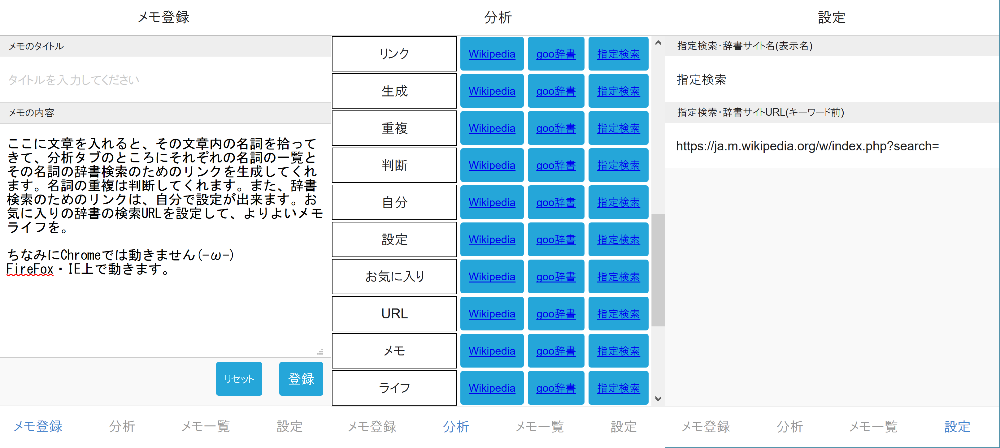

<h1>プロジェクト名：マナメモ</h1>
 
現在の開発状況:試作品。メモ登録機能なし、設定維持なし、html,フロントエンドのみ。 
展望：mongoDBを使ったメモ登録機能やユーザー管理、vue.js+node.js環境への移植、出来ればwebサービス的な物にしてみたい 
 
・概要 
形態素解析器kuromoji.jsを利用し、自動的に文章中の名詞の検索リンクを生成してくれるメモアプリケーション。 
WEBブラウザ上で動き、スマートフォン上でも使える。 
エディタにテキストタイプするとリアルタイムで名詞毎に辞書・百科サイトに直接行けるボタンを生成してくれる。 
サイトは設定で変更可。学習的なメモ、文章を意味的に分析する場面、文章内に未知語が多い場合や文章を校閲する場面にターゲットをおいた。 
 
・製作動機 
メモを書くとき等、範囲選択でコピー＆ペーストして一つ一つ希望の辞書で検索するのが手間だと感じたこと。 
また、マシンパワーが有り余るなか、メモアプリを単純に書くだけものにするのはもったいないのではないか？という疑問があったこと。 
デスクトップ環境では単語にマウスオーバーで意味を出してくれるブラウザアドオンがあるが、WEBアプリでそれに近いことが実装出来ないかと思ったこと。 
この三つの動機から、制作した。 
 
・課題 
アクセス性が思ったほど良くなかった。 
単語の並びが文の順番通りなので見づらく、検索リンク先が同タブ・アプリ内ではなく別タブで立ち上がる点が面倒 
複数回出現するからこの単語は重要だと判断して単語のランク付けをする機能や 
あるいはリンクを踏んだ回数からこの間も調べたなどの履歴機能が必要と思われる。 
サービスであれば検索回数なども入れてランク付けするとなおよいかもしれない 
同一タブ内、アプリ内で辞書サイトを開くようにすることも必要。 
 
 

 
This software includes the work that is distributed in the Apache License 2.0 
------------------------------------------------------------------------------------------------------------------------------------- 
Onsen UI 
    Copyright 2013-2017 ASIAL CORPORATION 
 
kuromoji.js(https://github.com/takuyaa/kuromoji.js) 
    Copyright Copyright 2014 Takuya Asano 
    Copyright 2010-2014 Atilika Inc. and contributors 
 
 
Licensed under the Apache License, Version 2.0 (the "License"); 
you may not use this file except in compliance with the License. 
You may obtain a copy of the License at 
 
    http://www.apache.org/licenses/LICENSE-2.0 
 
Unless required by applicable law or agreed to in writing, software 
distributed under the License is distributed on an "AS IS" BASIS, 
WITHOUT WARRANTIES OR CONDITIONS OF ANY KIND, either express or implied. 
See the License for the specific language governing permissions and 
limitations under the License. 
------------------------------------------------------------------------------------------------------------------------------------- 
The MIT License (MIT) 
 
Vue.js 
 Copyright (c) 2013-present, Yuxi (Evan) You 
 
Permission is hereby granted, free of charge, to any person obtaining a copy 
of this software and associated documentation files (the "Software"), to deal 
in the Software without restriction, including without limitation the rights 
to use, copy, modify, merge, publish, distribute, sublicense, and/or sell 
copies of the Software, and to permit persons to whom the Software is 
furnished to do so, subject to the following conditions: 
 
The above copyright notice and this permission notice shall be included in 
all copies or substantial portions of the Software. 
 
THE SOFTWARE IS PROVIDED "AS IS", WITHOUT WARRANTY OF ANY KIND, EXPRESS OR 
IMPLIED, INCLUDING BUT NOT LIMITED TO THE WARRANTIES OF MERCHANTABILITY, 
FITNESS FOR A PARTICULAR PURPOSE AND NONINFRINGEMENT. IN NO EVENT SHALL THE 
AUTHORS OR COPYRIGHT HOLDERS BE LIABLE FOR ANY CLAIM, DAMAGES OR OTHER 
LIABILITY, WHETHER IN AN ACTION OF CONTRACT, TORT OR OTHERWISE, ARISING FROM, 
OUT OF OR IN CONNECTION WITH THE SOFTWARE OR THE USE OR OTHER DEALINGS IN 
THE SOFTWARE. 
------------------------------------------------------------------------------------------------------------------------------------- 
